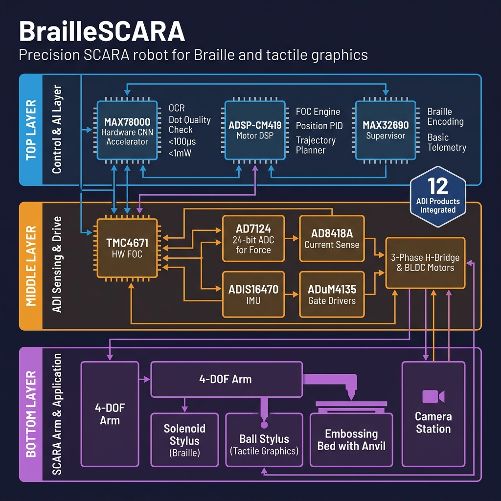

# BrailleSCARA: Precision Braille & Tactile Graphics Robot

  <i>A 4-DOF precision SCARA robot designed to convert printed text into Braille documents and draw tactile diagrams for the visually impaired at a sub-₹1 Lakh system cost.</i> 
  <b>Anveshan 2026 Proposal by Team SVNIT Surat</b>

---

## 🌍 The Problem & Our Impact
India has 15 million blind people, yet only 1% can read Braille due to the severe lack of affordable educational materials. While expensive imported machines (₹10 Lakh+) exist, they are restricted to elite institutions. 

**BrailleSCARA** replaces these industrial machines with a sub-₹1 Lakh Edge-AI robotic solution. By enabling local blind schools to produce both Braille text and **tactile STEM graphics** (math graphs, biology diagrams, maps), we are directly addressing **UN SDG 4 (Quality Education)** and **UN SDG 10 (Reduced Inequalities)**.

---

## ⚙️ End-to-End Workflow Pipeline
To understand how the robot operates without a PC, here is the complete autonomous pipeline:

1. **Dual Input Mode:** 
   - *Physical:* A camera reads a printed textbook page. ADI's MAX78000 runs OCR on-chip to extract text.
   - *Digital:* Teachers upload PDF/SVG documents via Bluetooth using the MAX32690 BLE 5.2 microcontroller.
2. **Translation:** Software converts the recognized text to Bharati Braille encoding and generates dot coordinates following strict ISO 17049 spacing standards.
3. **Paper Handling:** The SCARA arm picks a blank sheet of Braille paper from a tray and places it on the embossing bed.
4. **Precision Embossing:** The arm moves to each dot position with $\pm$0.05 mm accuracy using ADI's ADSP-CM419 + TMC4671 closed-loop FOC drive. A solenoid fires to create a raised dot.
5. **Quality Verification:** After each dot, a force sensor read by ADI's AD7124-8 (24-bit ADC) verifies the dot formed correctly. Shallow dots are instantly re-embossed.
6. **Tactile Diagrams:** For diagrams, the arm traces freeform paths with a spring-loaded ball stylus, creating raised lines that blind students can feel.
7. **Sorting:** Completed pages are picked and sorted into output trays by page number.

---

## 🏗️ System Architecture

Our entire architecture is built around maximizing the efficiency and precision of **7 Core Analog Devices (ADI)** components. 

  

### Core Subsystems (Strictly Required):
*   **Motor Control:** ADSP-CM419 (Outer Loop @ 10 kHz) + TMC4671 (Hardware FOC) ensuring smooth, silent, sub-0.1mm accuracy.
*   **Edge AI (Vision):** MAX78000 Hardware CNN runs OCR and Braille dot quality classification at `<1mW` power.
*   **Task Orchestration:** MAX32690 BLE 5.2 handles wireless PDF uploads and master state machine logic.
*   **Force Feedback:** AD7124-8 24-bit ADC digitizes load cell data to verify every single Braille dot mechanically.
*   **Power & Current Sense:** ADP5054 Quad SMPS and AD8418A Current Sense amplifiers form the electrical backbone.

---

## 🌟 Key Innovations

1. **Affordable Tactile Graphics:** Competitors at this price point can only print text. BrailleSCARA draws freeform raised-line tactile diagrams.
2. **Per-Dot Force Verification:** Every Braille machine in existence embosses dots blindly. Ours measures the force-displacement of every single dot and re-embosses immediately if it fails the threshold.
3. **100% Offline Edge AI:** The robot reads printed pages using the MAX78000 CNN without any external laptop or cloud internet connection.

---

## 📁 Repository Contents

*   **`main.tex` & Images:** The raw source code for our Anveshan 2026 Proposal.
*   **`ai_model/train_dot_classifier.py`:** PyTorch architecture and synthetic pre-training script for the MAX78000 dot quality classifier. Demonstrates the model fits within the 442KB SRAM limit (285K weights).
*   **`generate_force_graph.py`:** Mathematical simulation modeling the theoretical force applied by the solenoid against 140 GSM Braille paper yield resistance.

---

## 🚀 Future Plans (Post-Anveshan)
1. **Open-Source:** Publish mechanical CAD and firmware on GitHub so NGOs can replicate it globally.
2. **Pilot Program:** Partner with the National Association for the Blind to test in 3-5 blind schools in Gujarat.
3. **Research Publication:** Submit the force-verified embossing workflow to an IEEE robotics conference.

---

## 👥 Team SVNIT Surat
*   **Aman Gupta:** Team Lead / Edge AI (MAX78000)
*   **Aman Rana:** Firmware (FOC, Trajectory)
*   **Dhyan Modi:** Electronics (ADI Integration)
*   **Tanmay Singh:** Mechanical (SCARA CAD)
*   **Dr. Anand D. Darji:** Faculty Mentor
